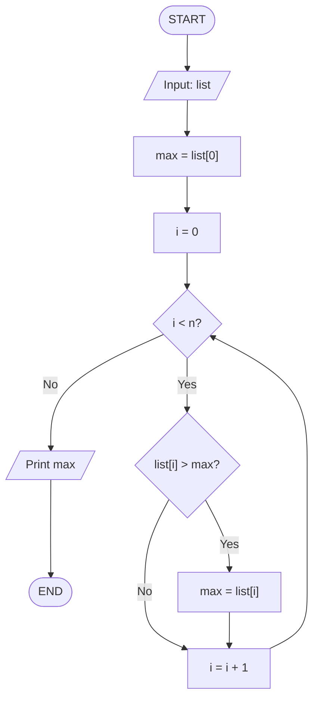

# Time Complexity, Flowcharts, and Pseudocode

Now that we understand the basics of programming, let's talk about something very important in DSA - **How efficient is our code?**

When you write a program, it's not just about whether it works or not. It's about how `fast` it runs and how much `memory` it uses.

## Time Complexity

**Time Complexity** is a way to describe how the running time of an algorithm grows as the input size grows.

Let me explain this with a simple example.

### Simple Example: Finding Maximum Number

Let's say you have a list of numbers, and you want to find the maximum number.

```
numbers = [5, 2, 8, 1, 9, 3]
```

You need to check each number one by one to find which one is the largest.

If you have 6 numbers, you need to check 6 numbers.
If you have 100 numbers, you need to check 100 numbers.
If you have `n` numbers, you need to check `n` numbers.

So the **time complexity** of this problem is proportional to the number of inputs. We call this `O(n)` (pronounced "Big O of n").

### Common Time Complexities

Here are the most common time complexities you'll encounter:

1. **O(1)** - Constant Time
   - The algorithm takes the same time regardless of input size.
   - Example: Accessing an element from a list by its index.

   ```
   element = list[0]  // Always takes same time
   ```

2. **O(n)** - Linear Time
   - The algorithm's time grows linearly with input size.
   - Example: Finding maximum in a list (checking each element once).

   ```
   loop through all n elements:
       check if current element is maximum
   ```

3. **O(n²)** - Quadratic Time
   - The algorithm's time grows with the square of input size.
   - Example: Comparing every pair of numbers.

   ```
   loop from i = 0 to n:
       loop from j = 0 to n:
           compare list[i] with list[j]
   ```

4. **O(log n)** - Logarithmic Time
   - The algorithm eliminates half of the remaining elements with each step.
   - Example: Binary search (we'll learn this later).

5. **O(n log n)** - Linear Logarithmic Time
   - Combination of linear and logarithmic.
   - Example: Many efficient sorting algorithms.

### Why Does Time Complexity Matter?

Let's say you have an algorithm with `O(n²)` time complexity and your input size is 1000.

The algorithm will do approximately `1000 × 1000 = 1,000,000` operations.

But if you can optimize it to `O(n log n)`, it will do approximately `1000 × 10 = 10,000` operations.

That's a **100 times faster** algorithm!

As the input size grows, this difference becomes even more significant.

---

## How to Draw a Flowchart

A **Flowchart** is a visual representation of an algorithm. It shows the flow of logic using different shapes and arrows.

### Flowchart Symbols

1. **Oval (Ellipse)** - Start/End
   - Used to mark the beginning or end of a process.

2. **Rectangle** - Process/Action
   - Used for a statement or an operation.
   - Example: `sum = sum + num`

3. **Diamond** - Decision/Condition
   - Used for an if-else statement or a condition.
   - Has two or more outputs (yes/no, true/false).

4. **Parallelogram** - Input/Output
   - Used for input operations (reading data) or output operations (printing data).

5. **Arrow** - Flow Direction
   - Shows the direction of the flow.

### Example: Finding Maximum Number

Let's draw a flowchart for finding the maximum number in a list.




> This flowchart shows the logic: we start with the first element as max, then loop through the rest and update if we find a larger number.


## How to Write Pseudocode

**Pseudocode** is a way to write the algorithm in a human-readable format that's somewhere between plain English and actual programming code.

Pseudocode is NOT actual code that runs on a computer. It's a way to communicate the logic of an algorithm clearly.

### Rules for Writing Pseudocode

1. Use simple, clear English statements.
2. Use standard programming keywords like `if`, `else`, `loop`, `function`, etc.
3. Use indentation to show blocks of code.
4. Don't worry about exact syntax, focus on the logic.
5. Use variable names that are meaningful.

### Example: Finding Maximum Number

Here's the pseudocode for finding the maximum number:

```
function findMaximum(list):
    max = list[0]

    for i from 1 to length(list) - 1:
        if list[i] > max:
            max = list[i]

    return max
```

Notice how it's written:

- Clear function name
- Simple variable names
- Logical flow with indentation
- Easy to understand even if you don't know a specific programming language

### Another Example: Sum of All Numbers

```
function sumAllNumbers(list):
    sum = 0

    for each number in list:
        sum = sum + number

    return sum
```

---

## Practice Problems

Now let's apply what we learned! For each problem below, you need to:

1. **Write the Pseudocode**
2. **Draw the Flowchart**
3. **Find the Time Complexity**

### Problem 1: Count Even Numbers

**Description:** Given a list of numbers, count how many even numbers are in the list.

**Input:** A list of integers
**Output:** The count of even numbers

**Example:**

```
Input: [1, 2, 3, 4, 5, 6]
Output: 3  (2, 4, 6 are even)
```

**Tasks:**

- Write pseudocode for this algorithm
- Draw a flowchart
- What is the time complexity? Why?

### Problem 2: Find Sum of First N Numbers

**Description:** Given a number N, find the sum of numbers from 1 to N.

**Input:** An integer N
**Output:** The sum of 1 + 2 + 3 + ... + N

**Example:**

```
Input: 5
Output: 15  (1 + 2 + 3 + 4 + 5 = 15)
```

**Tasks:**

- Write pseudocode for this algorithm (can you think of two different approaches?)
- Draw a flowchart for one approach
- What is the time complexity? Why?
- Which approach is better and why?

> **Hint:** Think of a simple loop approach and also think if there's a mathematical formula you could use.

### Problem 3: Check if Array is Sorted

**Description:** Given a list of numbers, check if the list is sorted in ascending order.

**Input:** A list of integers
**Output:** True if sorted, False otherwise

**Example:**

```
Input: [1, 3, 5, 7, 9]
Output: True

Input: [1, 3, 2, 7, 9]
Output: False
```

**Tasks:**

- Write pseudocode for this algorithm
- Draw a flowchart
- What is the time complexity? Why?


### Problem 4: Find Duplicate Numbers

**Description:** Given a list of numbers, check if there are any duplicate numbers in the list.

**Input:** A list of integers
**Output:** True if duplicates exist, False otherwise

**Example:**

```
Input: [1, 2, 3, 4, 5]
Output: False

Input: [1, 2, 3, 2, 5]
Output: True  (2 appears twice)
```

**Tasks:**

- Write pseudocode for this algorithm (the simple approach)
- Draw a flowchart
- What is the time complexity? Why?

> **Bonus:** Can you think of the time complexity if you use an approach with nested loops? (comparing each element with every other element)

## Summary

- **Time Complexity** tells us how fast an algorithm is and how it scales with input size.
- **Flowcharts** help us visualize the logic of an algorithm using shapes and arrows.
- **Pseudocode** helps us write the algorithm in a clear, language-independent way.

These three tools (Understanding time complexity, drawing flowcharts, and writing pseudocode) are essential skills in programming and DSA.

When you solve a problem, always think about:

1. What is the logic? (Draw a flowchart or write pseudocode)
2. How fast is my solution? (Calculate time complexity)
3. Can I do better?

Start with the practice problems above and make sure you can do all three tasks for each problem!
