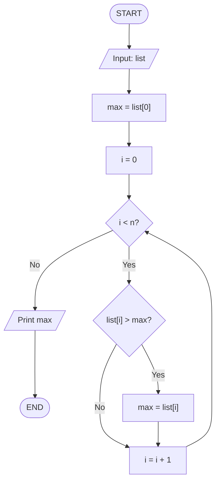

# The Basics

The basic building blocks of programming are:

1. Variables
2. Data Types
3. Arrays
4. Conditional Statements
5. Loops
6. Functions

## Variables and Data Types
**Variables** are like a `box` that holds a `value` of certain `data type`.

We can write a variable in the following way:

```
variable_name = value
```

Here, `variable_name` is the name of the variable and `value` is the value that it holds.

For example:

```
name = "John Doe"
```

The above line will assign the value `"John Doe"` to the variable `name`.

Now, like I said earlier the variable hold a value of a `data type`. In this case the variable `name` holds a value of `string` data type.

Values can be mainly of the following types:

1. String
2. Integer
3. Float
4. Boolean

String values are a `set of characters` that are written inside `double quotes` or `single quotes`.

For example:

```
"Why did I came here?"
```

In the above line we see a set of characters that are written inside double quotes. This is called a `string`.

The integer values are `whole numbers`.

For example: 1, 2, 3, 42069

The float values are `decimal numbers`.

For example: 1.0, 2.0, 3.9, 42069.42069

each language has its own set of data types. But in the end they all mean the same thing; what kind of data a variable holds.

The boolean values are `true` or `false` or `0` or `1`.

## Arrays

Arrays (or lists in Python) are ordered collections of values.

In some languages all elements must have the same type.

For example:

```
array = [1, 2, 3, 4, 5]
```

Where ever you look you'll see an array in programming.

> Will discuss more about arrays later as it is a data structure and has a lot of applications.

## Conditional Statements

Conditional statements are a way to make a decision based on a `condition` that is `true` or `false`.

this is the flow control of a program and is generally used to make a program more logical.

The syntax is as follows:

```
if condition:
    statement
else:
    statement
```

The `condition` can be anything that is `true` or `false`. Mainly it is a `boolean value`. The `statement` is a block of code that is executed if the `condition` is `true`. If the `condition` is `false` then the `statement` is not executed.

Else part is optional and is executed if the `condition` is `false`.

## Loops

`Loops` are a way to repeat a block of code multiple times.

For example, Let's say you want to multiply a number by 2, 10 times.

You have to write the same code 10 times.

We don't want that. So, instead of writing the same code 10 times, we can use a loop.

The syntax is as follows:

```
Loop from 1 to 10:
    print(5 * 2)
```

This will print the value 10 times.

There are mainly 2 types of loops:

1. For Loop
2. While Loop

For loop is used when you `know` the number of times you want to repeat the code.

While loop is used when you `don't know` the number of times you want to repeat the code but the code is repeated until a certain condition is `true`.

## Functions

Functions are a way to reuse a block of code.

Let's say you have a code that finds the number of even numbers in a list.

```
a = 10
b = 20
count = 0

loop from a to b -> i:
    if i % 2 == 0:
        count = count + 1

print(count)
```

> `->` means while the loop is running from `a` to `b`, the variable `i` holds the value of the current number being checked.

> i%2 == 0, is the condition that checks if the current number is even or not.
        
Now, this same code might be needed multiple times later on. So, instead of writing the same code multiple times, we can make this a function.

So, let's break it down.

In a sense, the main idea of the above code is to take two numbers as input and produce the number of even numbers between them.

So, What we can do is pack the above code where we can `pass` the two numbers as input and `return` the number of even numbers between them.

```
function count_even_numbers(a, b):
    count = 0

    loop from a to b -> i:
        if i % 2 == 0:
            count = count + 1

    return count
```
> `a` and `b` inside the bracket right after the function name are called `arguments`. These are the values that will be considered as input to the function.

this process is called `defining` a `function`. We can name the function whatever we want.

Now, what we can do is `call` the function by just writing the name of the function followed by the arguments.

```
count = count_even_numbers(10, 20)

print(count)
```

Here, inside the function, at the very last line we have a `return` statement. This is the value that will be `returned` by the function after all the calculations are done.

We can then use the returned value in any other part of the program.

Functions are specially useful because it makes the code more `modular` and `reusable`.

These are the tools and rules that we are bound to use in programming. Every programming language has these tools and rules. We will only use these tools to make our logic and solve a lot of problems.

Now, let's talk about `DSA`

## What is DSA?

> Data Structures and Algorithms are the building blocks of programming.

Data structure is the way to store, manage and organize data so that it can be easily accessed and manipulated.

A program heavily relies on data structures to perform its tasks quickly and efficiently.

Algorithms are the methods of manipulating data structures to solve a particular problem.

As DSA is the main topic of this course, we'll be talking about Data Structures and Algorithms in the coming weeks.

There a lot of data structures and each data structure has its own set of algorithms. 

Like, array has algorithms like searching, sorting, etc. Tree has algorithms like BFS, DFS etc.


# Some problems

Let's say you have 2 numbers `a` and `b` can you swap them?

Simple, we can take a third variable `c` and assign `a` to `c` and `b` to `a` and `c` to `b`.

```
a = 10
b = 20

c = a

a = b

b = c
```

But what if I tell you to find the maximum number between `a` and `b`?

We can compare `a` and `b` and assign the maximum number to a new variable.

```
a = 10
b = 20

if a > b:
    max = a

else:
    max = b

print(max)
```

Noice, How about maximum of three or an unknown number of numbers?

That'll be a pain to do manually because we have to compare all the numbers one by one.

But the only thing we are doing is `comparing`. So, to do this repeated comparing we can use a loop.

The idea is to just think that the first number is the maximum number and we start comparing it with the rest of the numbers. If we encounter a number that is greater than the maximum number, then we found the new maximum number.

And by the end of the comparison we are most definitely going to have the maximum number.

```
nums = [3,1,4,2,5,3]

max = nums[0]

loop from 1 to len(nums) -> i:
    if nums[i] > max:
        max = nums[i]

print(max)
```

Now, what about finding the second maximum number? then the third maximum number?

If we keep on `removing` the maximum number and then finding the `next` maximum number then we will get an interesting result.

```
nums = [3,1,4,2,5,3]
            ↓
1st max     5
            ↓
2nd         4
            ↓
3rd         3
            ↓
4th         3
            ↓
5th         2
            ↓
6th         1
```

We get a list of numbers that are sorted in descending order.

I just wanted to show you how almost all algorithms are connected and are improved from one problem to another.

# Time Complexity, Flowcharts, and Pseudocode

Now that we understand the basics of programming, let's talk about something very important in DSA - **How efficient is our code?**

When you write a program, it's not just about whether it works or not. It's about how `fast` it runs and how much `memory` it uses.

## Time Complexity

**Time Complexity** is a way to describe how the running time of an algorithm grows as the input size grows.

Let me explain this with a simple example.

### Simple Example: Finding Maximum Number

Let's say you have a list of numbers, and you want to find the maximum number.

```
numbers = [5, 2, 8, 1, 9, 3]
```

You need to check each number one by one to find which one is the largest.

If you have 6 numbers, you need to check 6 numbers.
If you have 100 numbers, you need to check 100 numbers.
If you have `n` numbers, you need to check `n` numbers.

So the **time complexity** of this problem is proportional to the number of inputs. We call this `O(n)` (pronounced "Big O of n").

### Common Time Complexities

Here are the most common time complexities you'll encounter:

1. **O(1)** - Constant Time
   - The algorithm takes the same time regardless of input size.
   - Example: Accessing an element from a list by its index.

   ```
   element = list[0]  // Always takes same time
   ```

2. **O(n)** - Linear Time
   - The algorithm's time grows linearly with input size.
   - Example: Finding maximum in a list (checking each element once).

   ```
   loop through all n elements:
       check if current element is maximum
   ```

3. **O(n²)** - Quadratic Time
   - The algorithm's time grows with the square of input size.
   - Example: Comparing every pair of numbers.

   ```
   loop from i = 0 to n:
       loop from j = 0 to n:
           compare list[i] with list[j]
   ```

4. **O(log n)** - Logarithmic Time
   - The algorithm eliminates half of the remaining elements with each step.
   - Example: Binary search (we'll learn this later).

5. **O(n log n)** - Linear Logarithmic Time
   - Combination of linear and logarithmic.
   - Example: Many efficient sorting algorithms.

### Why Does Time Complexity Matter?

Let's say you have an algorithm with `O(n²)` time complexity and your input size is 1000.

The algorithm will do approximately `1000 × 1000 = 1,000,000` operations.

But if you can optimize it to `O(n log n)`, it will do approximately `1000 × 10 = 10,000` operations.

That's a **100 times faster** algorithm!

As the input size grows, this difference becomes even more significant.

---

## How to Draw a Flowchart

A **Flowchart** is a visual representation of an algorithm. It shows the flow of logic using different shapes and arrows.

### Flowchart Symbols

1. **Oval (Ellipse)** - Start/End
   - Used to mark the beginning or end of a process.

2. **Rectangle** - Process/Action
   - Used for a statement or an operation.
   - Example: `sum = sum + num`

3. **Diamond** - Decision/Condition
   - Used for an if-else statement or a condition.
   - Has two or more outputs (yes/no, true/false).

4. **Parallelogram** - Input/Output
   - Used for input operations (reading data) or output operations (printing data).

5. **Arrow** - Flow Direction
   - Shows the direction of the flow.

### Example: Finding Maximum Number

Let's draw a flowchart for finding the maximum number in a list.




> This flowchart shows the logic: we start with the first element as max, then loop through the rest and update if we find a larger number.


## How to Write Pseudocode

**Pseudocode** is a way to write the algorithm in a human-readable format that's somewhere between plain English and actual programming code.

Pseudocode is NOT actual code that runs on a computer. It's a way to communicate the logic of an algorithm clearly.

### Rules for Writing Pseudocode

1. Use simple, clear English statements.
2. Use standard programming keywords like `if`, `else`, `loop`, `function`, etc.
3. Use indentation to show blocks of code.
4. Don't worry about exact syntax, focus on the logic.
5. Use variable names that are meaningful.

### Example: Finding Maximum Number

Here's the pseudocode for finding the maximum number:

```
function findMaximum(list):
    max = list[0]

    for i from 1 to length(list) - 1:
        if list[i] > max:
            max = list[i]

    return max
```

Notice how it's written:

- Clear function name
- Simple variable names
- Logical flow with indentation
- Easy to understand even if you don't know a specific programming language

### Another Example: Sum of All Numbers

```
function sumAllNumbers(list):
    sum = 0

    for each number in list:
        sum = sum + number

    return sum
```

---

## Practice Problems

Now let's apply what we learned! For each problem below, you need to:

1. **Write the Pseudocode**
2. **Draw the Flowchart**
3. **Find the Time Complexity**

### Problem 1: Count Even Numbers

**Description:** Given a list of numbers, count how many even numbers are in the list.

**Input:** A list of integers
**Output:** The count of even numbers

**Example:**

```
Input: [1, 2, 3, 4, 5, 6]
Output: 3  (2, 4, 6 are even)
```

**Tasks:**

- Write pseudocode for this algorithm
- Draw a flowchart
- What is the time complexity? Why?

### Problem 2: Find Sum of First N Numbers

**Description:** Given a number N, find the sum of numbers from 1 to N.

**Input:** An integer N
**Output:** The sum of 1 + 2 + 3 + ... + N

**Example:**

```
Input: 5
Output: 15  (1 + 2 + 3 + 4 + 5 = 15)
```

**Tasks:**

- Write pseudocode for this algorithm (can you think of two different approaches?)
- Draw a flowchart for one approach
- What is the time complexity? Why?
- Which approach is better and why?

> **Hint:** Think of a simple loop approach and also think if there's a mathematical formula you could use.

### Problem 3: Check if Array is Sorted

**Description:** Given a list of numbers, check if the list is sorted in ascending order.

**Input:** A list of integers
**Output:** True if sorted, False otherwise

**Example:**

```
Input: [1, 3, 5, 7, 9]
Output: True

Input: [1, 3, 2, 7, 9]
Output: False
```

**Tasks:**

- Write pseudocode for this algorithm
- Draw a flowchart
- What is the time complexity? Why?


### Problem 4: Find Duplicate Numbers

**Description:** Given a list of numbers, check if there are any duplicate numbers in the list.

**Input:** A list of integers
**Output:** True if duplicates exist, False otherwise

**Example:**

```
Input: [1, 2, 3, 4, 5]
Output: False

Input: [1, 2, 3, 2, 5]
Output: True  (2 appears twice)
```

**Tasks:**

- Write pseudocode for this algorithm (the simple approach)
- Draw a flowchart
- What is the time complexity? Why?

> **Bonus:** Can you think of the time complexity if you use an approach with nested loops? (comparing each element with every other element)

## Summary

- **Time Complexity** tells us how fast an algorithm is and how it scales with input size.
- **Flowcharts** help us visualize the logic of an algorithm using shapes and arrows.
- **Pseudocode** helps us write the algorithm in a clear, language-independent way.

These three tools (Understanding time complexity, drawing flowcharts, and writing pseudocode) are essential skills in programming and DSA.

When you solve a problem, always think about:

1. What is the logic? (Draw a flowchart or write pseudocode)
2. How fast is my solution? (Calculate time complexity)
3. Can I do better?

Start with the practice problems above and make sure you can do all three tasks for each problem!
